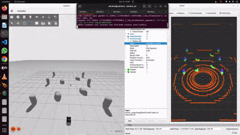

### ROS 2 Navigation and Pole Detection Guide: \
This repository documents the process of setting up and practicing ROS 2 navigation components (Mapping, SLAM, AMCL, NAV2) step-by-step, as well as developing a novel pole detection algorithm using 3D LiDAR point cloud data.

Tutorial Source: "The instructions in this repository are based on the Husarion ROS 2 Tutorial". Thanks to husarion for giving such a well documented repository. \
Please refer this tutorial link for more information, https://husarion.com/tutorials/ros2-tutorials/1-ros2-introduction/

Installation instruction: \
Follow the steps below to set up the environment:

### Create a workspace and clone the repository
mkdir -p rosbot_ws/src \
cd rosbot_ws \
git clone https://github.com/darshan-kt/poles_detection_with_pcl.git \
cd ~ rosbot_ws \
rosdep install -i --from-path src --rosdistro $ROS_DISTRO -y 

#### Build the workspace
cd ~ rosbot_ws \
colcon build --symlink-install

#### Add the workspace to the bashrc for easy sourcing
echo 'source ~/rosbot_ws/install/setup.bash' >> ~/.bashrc \
source ~/.bashrc

-----------------------

### Practicing ROS 2 Navigation
#### Running the Simulator
#### Terminal 1:  Launch the simulation robot:
ros2 launch rosbot_xl_gazebo simulation.launch.py

#### Terminal 2:  Teleop control (keyboard control):
ros2 run teleop_twist_keyboard teleop_twist_keyboard

#### Terminal 3:  Visualize in Rviz:
rviz2

-----------------------

### Mapping (SLAM Toolbox)
#### Terminal 1: Launch the simulation robot:
ros2 launch rosbot_xl_gazebo simulation.launch.py

#### Terminal 2:  Start SLAM Toolbox:
ros2 launch robot_navigation slam.launch.py use_sim_time:=true

#### Terminal 3:  Visualize in Rviz:
rviz2

#### Terminal 4: Teleop control:
ros2 run teleop_twist_keyboard teleop_twist_keyboard

#### Terminal 5: Save the map:
ros2 run nav2_map_server map_saver_cli -f map

------------------------------------

### Loading a Saved Map
#### Terminal 1:  Start the Map Server:
ros2 run nav2_map_server map_server --ros-args -p yaml_filename:=map.yaml -p use_sim_time:=true

#### Terminal 2:  Bring up the Map Server Lifecycle Node:
ros2 run nav2_util lifecycle_bringup map_server

-------------------------------------

### Localization (AMCL)
#### Terminal 1: Launch the simulation robot:
ros2 launch rosbot_xl_gazebo simulation.launch.py

#### Terminal 2: Run AMCL:
ros2 launch robot_navigation amcl.launch.py use_sim_time:=true

#### Terminal 3: Visualize in Rviz:
rviz2

#### Note: Add ParticleCloud and select the /particle_cloud topic. Use the 2D Pose Estimate tool to set the robot's initial pose.

------------------------------

### Navigation
#### Terminal 1: Launch the simulation robot:
ros2 launch rosbot_xl_gazebo simulation.launch.py

#### Terminal 2: Visualize in Rviz:
rviz2

#### Note: Ensure the map topic is selected before launching NAV2.

#### Terminal 3: Run NAV2:
ros2 launch robot_navigation navigation.launch.py use_sim_time:=true

--------------------------------

### Pole Detection and Midpoint Calculation
### This repository includes a custom algorithm to detect poles and calculate their midpoints using 3D LiDAR point cloud data.

#### Terminal 1: Launch the simulation robot with a custom poles environment:
ros2 launch rosbot_xl_gazebo simulation_poles.launch.py

#### Terminal 2: Visualize in Rviz:
rviz2

#### Terminal 3: Run the pole detection algorithm:
ros2 run find_poles_pkg pole_detection

#### Terminal 4: Calculate the midpoint:
ros2 run find_poles_pkg midpoint

#### Terminal 5: Teleop the robot:
ros2 run teleop_twist_keyboard teleop_twist_keyboard

#### Note: 
Ensure the robot and Rviz are correctly configured for visualization.
For NAV2, the map topic is published only once. Run Rviz and select the map topic before launching NAV2.
Follow the Husarion tutorial for detailed guidance and troubleshooting.